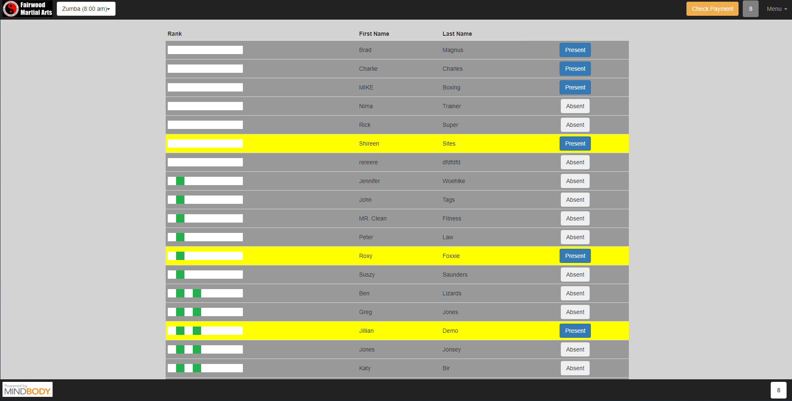

# Martial Arts Attendance and Promotion Tracker

## Live site
[https://projects.zarlengo.net/attendance/index.php](https://projects.zarlengo.net/attendance/index.php)

## Description
A php based website which connects to the [mindbodyonline API](https://developers.mindbodyonline.com/) to provide a clean, easy to use interface between the business management software and the isntructors running a class

## Usage
### Main Page
### Add / Remove Client
### Add to Promotion Class
### Promotion Class

## License
    Copyright © 2020 Chris Zarlengo
    No license is provided for the code within this repository. 

## Contributing
* [Zarlengo](https://github.com/Zarlengo)

## Questions
* [Github Profile for Zarlengo](https://github.com/Zarlengo)
* [File an issue](https://github.com/Zarlengo/Fitness-Tracker/issues)
